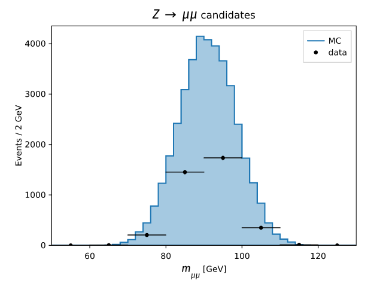
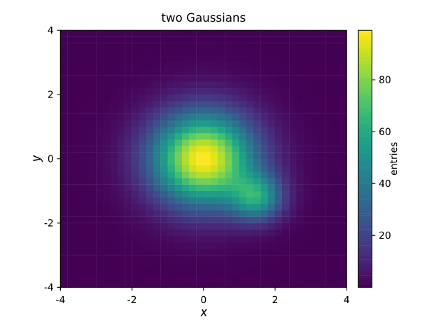

# oxiroot

[](LICENSE)
[](https://www.rust-lang.org)
[](#)

Pure-Rust IO for the [CERN ROOT](https://root.cern) file format — **read and
write** RNTuple, `TTree`, the classic histogram family, and graphs in the ROOT
(`TFile`) container, with **no C++/libROOT or Python dependency**. Files written
by oxiroot open in official ROOT and uproot, and oxiroot reads files they write.

> The name is *ROOT + oxide* — Rust is oxidized iron.

## Highlights

- 🦀 **Pure Rust** — the on-disk format reimplemented from the official specs.
  No libROOT, no Python; builds and runs anywhere Rust does, depending only on a
  handful of small pure-Rust crates (compression codecs and a hasher).
- 🔄 **Two-way interop** — every reader and writer is validated against both
  official ROOT (C++) and uproot, in both directions.
- 📊 **Histograms & profiles** — `TH1`/`TH2`/`TH3` (every precision),
  `TProfile`/`TProfile2D`/`TProfile3D`, `TEfficiency`, N-dimensional `THnSparse`,
  and polygon-binned `TH2Poly` — all read **and** write.
- 📈 **Graphs** — `TGraph`, `TGraphErrors`, `TGraphAsymmErrors`, plus `TGraph2D`
  and `TGraphMultiErrors` — read and write, including a graph's display frame
  (`fHistogram`) and attached fitted functions (`fFunctions`, faithful `TF1`).
- 🌳 **`TTree`** — read and write scalar, fixed/variable-length array, string,
  `std::vector<T>`, and **split `std::vector<MyStruct>`** branches; read nested
  structs, `std::vector<std::vector<T>>`, `TClonesArray`, and split single
  objects; multi-basket via a bounded-memory streaming writer.
- 🧱 **RNTuple** — read and write ROOT's columnar format (scalars, strings,
  vectors, **nested vectors and vectors of records**, fixed-size
  `std::array`/`std::bitset`, user classes, `std::set`/`std::map`), read
  *unsplit* streamer fields, compressed, multi-cluster via a streaming writer.
- 🗜 **Compression** — decode Zstd / zlib / LZ4 / LZMA; encode Zstd / zlib /
  LZ4 — all pure Rust, all read back by ROOT and uproot.
- 🧵 **Multithreaded fill** — `ThreadedHist`, the pure-std analog of ROOT's
  `TThreadedObject<TH1>`; optional one-call `rayon` parallel fill.
- 🎨 **Plotting** (optional) — render `TH1`/`TH2`/`TGraph`/`TProfile` to **SVG,
  PNG, and PDF** with a matplotlib-like API and an mplhep histogram style —
  grids, ratio plots, LaTeX (`$…$`) math labels — all pure Rust, no matplotlib,
  no system fonts.
- 🛡 **Robust by construction** — readers never panic on malformed input
  (fuzz-tested), and writers refuse to silently corrupt a file past the 2 GiB
  32-bit limit.

## Quick start

Not yet on crates.io — depend on it via git. Pull in everything through the
facade, or just the part you need: the histogram, tree, and RNTuple crates are
independent, so a histogram-only project never compiles the others.

```toml
[dependencies]
# Everything — histograms, graphs, TTree, RNTuple — through the facade:
oxiroot = { git = "https://github.com/mathieuouillon/oxiroot" }

# …or depend on just one crate from the same repo:
oxiroot-hist    = { git = "https://github.com/mathieuouillon/oxiroot" }  # histograms + graphs
oxiroot-tree    = { git = "https://github.com/mathieuouillon/oxiroot" }  # TTree
oxiroot-rntuple = { git = "https://github.com/mathieuouillon/oxiroot" }  # RNTuple
```

```rust
use oxiroot::prelude::*;

// Fill and save one histogram — the WriteRoot / ReadRoot traits.
let mut h = TH1::new(50, 0.0, 100.0).named("pt").titled("p_{T}");
h.sumw2();
h.fill_weight(42.0, 1.5);
h.write_root("hist.root", Compression::Zstd(5))?;            // any single writable object
let same = TH1::read_root(&RFile::open("hist.root")?, "pt")?; // any readable object

// Several objects, subdirectories, or appending — the RootFile builder.
let prof = TProfile::new(5, 0.0, 5.0).named("prof").titled("<pt> per region");
RootFile::create("out.root")
    .add(&h)                              // any &dyn WriteRoot: hist, profile, graph…
    .dir("by_region", |d| d.add(&prof))   // a TDirectory
    .write(Compression::Zstd(5))?;
let g = RFile::open("out.root")?;
let p = TProfile::read_root_in(&g, "by_region", "prof")?;   // read from a subdirectory

// Write a TTree, then read a branch back.
let branches = vec![
    Branch::i32("n", vec![1, 2, 3]),
    Branch::f64("pt", vec![10.5, 20.1, 33.7]),
];
Tree::new("Events", branches).write_root("tree.root", Compression::None)?;
let f = RFile::open("tree.root")?;
let t = TTree::open(&f, "Events")?;
let BranchValues::F64(pt) = t.read_branch(&f, "pt")? else { panic!() };

// Write a columnar RNTuple, then read it back.
let fields = vec![Field::f64("mass", vec![91.2, 125.0])];
Ntuple::new("events", fields).write_root("data.root", Compression::None)?;
let n = RNTuple::open(&RFile::open("data.root")?, "events")?.num_entries();
```

The [`analysis` example](crates/oxiroot/examples/analysis.rs) is an end-to-end
mini analysis — weighted/variable-bin histograms → scale/merge/normalize →
per-region subdirectories → a columnar event dataset → read-back:

```sh
cargo run -p oxiroot --example analysis
```

## Features

### Histograms & profiles (`oxiroot::hist`)

- **Read & write** `TH1`/`TH2`/`TH3` in every precision (`D`/`F`/`I`/`S`/`C`/`L`),
  `TProfile`/`TProfile2D`/`TProfile3D`, `TEfficiency`, N-dimensional `THnSparse`,
  and polygon-binned `TH2Poly` (arbitrary-shape bins, with a builder API).
- **One way per operation**, not a function per type. Write one object with
  `h.write_root(path, compression)?` and read one with
  `TH1::read_root(&file, name)?` (the `WriteRoot`/`ReadRoot` traits; also
  `h.to_root_bytes()` and `TH1::read_root_in(&file, dir, name)?` for a
  subdirectory). A `TH1`/`TH2`/`TH3`'s on-disk precision is a typed `Precision`
  set with `.with_precision(Precision::Float)` (writes a `TH1F`), and
  `h.class_name()` reconstructs the ROOT class. Profiles carry a typed
  `ErrorMode`.
- **No forced names, no global registry.** A histogram is just data: construct
  it with `TH1::new(nbins, lo, hi)` and name it only when you persist it —
  `.named("pt")` sets the file key (`.titled(...)` the title). Unlike ROOT there
  is no `gROOT`/`gDirectory`, so any number of same-named histograms coexist in
  memory; and writing two objects under the same key name in one directory is a
  loud `DuplicateName` error, never ROOT's silent shadow-on-read.
- Create and `fill`/`fill_weight` with ROOT's exact `Fill` semantics; uniform or
  variable (`new_variable`) bins; `sumw2()` (chains: `h.sumw2().fill(x)`) for
  weighted per-bin errors (`bin_error`).
- Arithmetic with `Sumw2` error propagation: `scale` (also `h *= c` / `h * c`),
  `add` (the bin-by-bin merge used to combine job outputs), `multiply`, `divide`,
  `integral`. Bins read by cell index (`h[bin]`) or iterator (`for &c in &h`);
  a shared `Histogram` trait (`contents`/`entries`/`sum`) abstracts over `TH1/2/3`,
  and every type implements `Display` for a one-line summary.
- Statistics & shape accessors: `mean`/`std_dev`/`rms`, `maximum`/`minimum`/
  `maximum_bin`, `find_bin`, `bin_center`/`bin_width`/`bin_low_edge`,
  `effective_entries`, `reset`, `interpolate`, `quantiles`; derived histograms
  `rebin`/`rebin2d`/`rebin3d`, `cumulative`, projections (`TH2`→`TH1`;
  `TH3`→`TH1`/`TH2`), and `profile_x`/`profile_y` — all carrying the statistical
  moment sums so the results' `mean`/`std_dev` stay correct.
- Compatibility tests: `chi2_test`/`chi2_test_with` (Pearson χ², all three
  `UU`/`UW`/`WW` weighting schemes) and `kolmogorov_test`, returning ROOT-matched
  p-values. Alphanumeric (labelled) axes round-trip through `TAxis::labels`
  (read **and** write, with `set_label`).
- **Fitting** (optional `fit` feature) — fit a parametric model to **any 1-D
  data**: a histogram, a `TGraph`, or your own `(x, y, σ)` points. The standalone
  [`oxiroot::fit`](#fitting-oxirootfit-fit-feature) crate provides the `Model`
  (built-in `gaussian`/`exponential`/`polynomial`, or a custom closure) and a
  pure-Rust Minuit2 minimizer; anything implementing the `FitData` trait gets
  `.fit(&model)` (Neyman/Pearson χ² or binned Poisson likelihood), returning
  parameters, parabolic + MINOS errors, covariance, and `chi2`/`ndf`.
- **Multithreaded fill** — `ThreadedHist`, the pure-Rust analog of ROOT's
  `TThreadedObject<TH1>`: share `&hist`, call `hist.fill(x)` from any thread —
  each thread transparently gets its own copy — then `hist.merge()` combines them
  exactly (contents + `Sumw2` + every moment sum), identical to a serial fill:
  ```rust
  let hist = ThreadedHist::new(TH1::new(100, 0.0, 100.0).named("h"));
  std::thread::scope(|s| for chunk in data.chunks(n) {
      let hist = &hist;
      s.spawn(move || for &x in chunk { hist.fill(x); });
  });
  let merged = hist.merge()?;
  ```
  No `Arc`, no manual slots; `with_local(|h| …)` batches fills or reaches any
  method, and the optional `rayon` feature adds a one-call
  `fill_par(&template, &data, |h, &x| h.fill(x))`. See
  [`examples/threaded.rs`](crates/oxiroot/examples/threaded.rs).
- Write one object with `h.write_root(path, compression)`. For several objects,
  subdirectories, or appending, use the `RootFile` builder — one entry point for
  all file composition:
  ```rust
  RootFile::create("out.root")
      .add(&h)                            // any &dyn WriteRoot: hist, profile, graph…
      .add(&prof)
      .dir("by_region", |d| d.add(&sig))  // a TDirectory per region
      .write(Compression::Zstd(5))?;
  RootFile::open("out.root")?.add(&extra).write(Compression::None)?; // append
  ```
  Written files embed a `TStreamerInfo` list, so they are self-describing for any
  ROOT reader.

### Fitting (`oxiroot::fit`, `fit` feature)

Fitting lives in its **own crate** (`oxiroot-fit`), so it works on **any 1-D
data**, not just histograms. A dataset implements the `FitData` trait (yielding
`(x, y, σ)` points) and the blanket `FitExt` gives it `.fit(&model)`. `TH1` and
`TGraph` implement `FitData` out of the box, and `Points` (or your own `FitData`
impl) covers everything else. `fit` is χ² by default; `fit_with` picks the cost
(Neyman or Pearson chi-square, or a binned Poisson likelihood) and `fit_opts`
adds a fit range and opt-in MINOS errors. `Model` (alias `TF1`) is built-in
(`gaussian`, `exponential`, `polynomial`) or a closure `f(x, params)`, with
per-parameter limits, fixing, and a data-driven seed. The fit returns the
parameters, parabolic errors, optional asymmetric MINOS errors and covariance
matrix, and `chi2`/`ndf` (with `chi2_per_ndf()` and a goodness-of-fit
`p_value()`). The χ² survival function it shares with the comparison tests lives
in the dependency-free `oxiroot-stat` crate.

Two minimizer backends are selectable via `FitOptions::minimizer(...)`: the
default `Minimizer::Minuit2` (the pure-Rust Minuit2 MIGRAD — ROOT's algorithm,
with parabolic + MINOS errors and the covariance), and, behind the **`argmin`
feature**, `Minimizer::NelderMead` — a gradient-free simplex from the
[`argmin`](https://crates.io/crates/argmin) crate (parameter errors from a
numerical Hessian; no MINOS), a handy independent cross-check.

```rust
let fit = data.fit_opts(&model, &FitOptions::new().minimizer(Minimizer::NelderMead));
```

```rust
use oxiroot::prelude::*; // needs `--features fit`

let mut h = TH1::new(60, 80.0, 100.0).named("mass").titled("di-muon mass");
h.sumw2();
// … fill h with events …

// Gaussian peak fit (chi-square). `estimate_from` seeds (constant, mean, sigma)
// from the bins — no manual moment loop, and it works for set_bin_content too.
let model = TF1::gaussian("z").estimate_from(&h);
let fit = h.fit(&model);
println!("mean = {:.3} ± {:.3}", fit.params[1], fit.errors[1]);
println!("chi2/ndf = {:.2}, p = {:.3}", fit.chi2_per_ndf(), fit.p_value());

let ml = h.fit_with(&model, FitMethod::Likelihood); // binned Poisson likelihood

// Full control: fit the core ±window, keep sigma positive, and ask for MINOS.
let opts = FitOptions::new().range(85.0, 97.0).with_minos(true);
let mut peak = TF1::gaussian("z").estimate_from(&h).lower_limit("sigma", 0.0);
let r = h.fit_into(&mut peak, &opts); // writes the fit back into `peak`
if let Some(minos) = &r.minos {
    println!("mean +{:.3} {:.3}", minos[1].1, minos[1].0); // asymmetric errors
}

// A custom model — Gaussian signal on a flat background — as a closure.
let sig_bkg = TF1::new(
    "s+b", &["norm", "mean", "sigma", "bkg"], vec![h.maximum(), 91.0, 2.0, 0.0],
    |x, q| q[0] * (-0.5 * ((x - q[1]) / q[2]).powi(2)).exp() + q[3],
);
let r = h.fit(&sig_bkg);

// The SAME `Model` + `.fit()` works on a TGraph …
let graph = TGraph::with_errors(x.clone(), y.clone(), ex, ey).named("g");
let line = graph.fit(&Model::polynomial("line", 1).with_params(vec![0.0, 0.0]));

// … and on raw points (a `Vec`/slice of `Point`, or your own `FitData` impl).
let data = Points::new(&x, &y, &sigma);
let peak = data.fit(&Model::gaussian("g").estimate_from(&data));
```

A runnable worked example (fits a Z → μμ peak, then the same models to a
`TGraph` and to raw points):

```sh
cargo run -p oxiroot --example fit --features fit
```

### Graphs (`oxiroot::hist`)

A single `TGraph` type covers all three ROOT classes, selected by its `errors`
field: plain (`TGraph`), symmetric (`TGraphErrors`), or asymmetric
(`TGraphAsymmErrors`); the class is detected on read by `TGraph::read_root`.
`TGraph2D` (3-D scatter) and `TGraphMultiErrors` (several y-error layers) are
separate types with the same read/write traits.

```rust
use oxiroot::prelude::*;
let g = TGraph::with_errors(
    vec![1.0, 2.0, 3.0], vec![10.0, 20.0, 30.0], // x, y
    vec![0.1, 0.1, 0.1], vec![1.0, 2.0, 1.5],    // ex, ey
).named("res").titled("resolution");
g.write_root("graph.root", Compression::None)?;             // WriteRoot, like any object
let same = TGraph::read_root(&RFile::open("graph.root")?, "res")?;
```

A graph also round-trips ROOT's display frame (`fHistogram`) and the fitted
functions ROOT stores in `fFunctions` — read back as `GraphFunction`s (faithful
`TF1`/`TFormula`) and re-evaluable in ROOT:

```rust
use oxiroot::prelude::*;
let g = TGraph::new(vec![0.0, 1.0, 2.0], vec![1.0, 3.0, 5.0])
    .named("gfit")
    .with_function(GraphFunction::new("line", "[0]+[1]*x", vec![1.0, 2.0], 0.0, 2.0));
g.write_root("gfit.root", Compression::None)?;
```

### Plotting (`oxiroot::plot`, `plot` feature)

Render histograms and graphs to **SVG, PNG, and PDF** with a matplotlib-like API and an
mplhep histogram style — **pure Rust**, no matplotlib, no system fonts. One
backend-independent draw IR fans out to a [`tiny-skia`](https://crates.io/crates/tiny-skia)
raster (PNG) and a hand-written SVG, so the two outputs share identical geometry.
The default font is the bundled **STIX Two** (a LaTeX-like serif), and `$…$`
labels are typeset as real LaTeX math by the pure-Rust
[ReX](https://github.com/KenyC/ReX) TeX engine into the same IR.

<p align="center">
  
  
</p>

<sub>Both figures are produced by `cargo run -p oxiroot --example plot --features plot` (PNG **and** SVG).</sub>

```rust
use oxiroot::plot::{Axes, HistType, HistOpts, ErrorbarOpts, Hist2dOpts, Color};
use oxiroot::prelude::*; // needs `--features plot`

// A filled MC histogram with "data" points overlaid + a legend.
let mut ax = Axes::new();
ax.hist_with(&mc, HistOpts::new().histtype(HistType::Fill).label("MC"));   // mplhep staircase
ax.errorbar_with(&data, ErrorbarOpts::new().color(Color::BLACK).label("data")); // a TGraph
ax.xlabel("$m_{\\mu\\mu}$ [GeV]");       // LaTeX math axis label
ax.ylabel("Events / 2 GeV");
ax.legend();
ax.save("mass.png")?;                    // format chosen by extension
ax.save("mass.svg")?;

// A TH2 as a viridis heatmap with a colorbar.
let mut ax2 = Axes::new();
ax2.hist2d_with(&th2, Hist2dOpts::new().label("entries"));
ax2.save("heatmap.svg")?;
# Ok::<(), oxiroot::plot::Error>(())
```

- **`Axes`** mirrors matplotlib (with Rust-idiomatic names): `hist`/`hist_with`
  (`TH1`, mplhep step/fill/band/errorbar staircase with `√N`/Sumw2 error bars),
  `errorbar`/`errorbar_with` (`TGraph`, all three error variants), `profile`
  (`TProfile`), `hist2d`/`hist2d_with` (`TH2` color mesh with a colorbar and the
  real matplotlib `viridis`/`plasma` colormaps), `plot`, `function` (overlay any
  analytic or fitted curve), `grid`, `xlabel`/`ylabel`/`title`, `xlim`/`ylim`
  (taking a `Range`, e.g. `ax.xlim(0.0..100.0)`), and `legend`. The `*_with`
  methods take an options builder; the bare ones use defaults.
- **Overlay a fit** — `ax.function(|x| …, x0..x1)` draws any closure as a smooth
  curve; with the `fit` feature, `ax.model(&model, x0..x1)` overlays a fitted
  [`oxiroot::fit`](#fitting-oxirootfit-fit-feature) `Model` directly on a histogram.
- **Multi-panel layouts** — `subplots_grid(rows, cols)` and a custom `GridSpec`
  (height/width ratios, spacing) with `fig.sharex()`/`sharey()` and a `suptitle`,
  plus a one-call `ratio_subplots()` for the HEP main-over-ratio plot (shared
  x-axis, the upper panel's x labels hidden).
- **Output** — `save`/`save_with` pick the format from the extension: `.png`,
  `.svg`, **and `.pdf`** (a hand-written vector PDF). `SaveOpts` sets the **DPI**
  for a sharper PNG (`save_with(path, SaveOpts::new().dpi(300.0))`) or a
  transparent background; `to_png_bytes`/`to_svg_string` render in memory.
- **Fonts** — the default is **STIX Two** (a LaTeX-like serif: STIX Two Text +
  STIX Two Math) for a publication look with text and math in one typeface.
  `ax.fonts(FontSet::dejavu())` switches to the matplotlib sans-serif look, and
  `FontSet::from_path("MyFont.otf")` / `from_paths(text, math)` plug in any
  TrueType/OpenType font (the math font needs a `MATH` table).
- The default look otherwise reproduces a plain matplotlib figure (640×480, the
  `tab10` color cycle, out-pointing ticks, 5 % margins, light grey grid);
  `Style::mplhep()` switches to in-pointing ticks on all four sides with minor ticks.
- A worked example renders a Z → μμ overlay and a 2-D heatmap to PNG **and** SVG:
  ```sh
  cargo run -p oxiroot --example plot --features plot
  ```

### TTree (`oxiroot::tree`)

- **Read & write** scalar, fixed-size array (`x[N]`, incl. multidimensional
  `x[N][M]`), variable-length / jagged (`x[n]`), string, multi-leaf (leaflist
  `a/F:b/I`), and `std::vector<T>` branches; **read** `std::vector<std::string>`.
- **Split `std::vector<MyStruct>`** branches written as per-member sub-branches
  (`TBranchElement`), with a generated `TStreamerInfo` for the element class —
  ROOT-C++- and uproot-verified, both directions.
- `Branch::{i32, f64, bools, strings, …}` for scalars, `Branch::vec_*` for
  fixed arrays, `Branch::jagged_*` for variable arrays, `Branch::vector_*` for
  `std::vector<T>`, and `Branch::split_vector` for split structs.
- `Tree::new(name, branches).write_root(path, compression)` is the method form
  (mirroring `hist.write_root`); `.write_root_baskets(…, entries_per_basket)`
  writes several baskets per branch, and `.to_root_bytes(…)` returns the file
  bytes. The free `write_tree_file`/`write_tree_file_baskets` functions remain.
- `TTreeWriter` streams a tree in batches (`write_batch` emits one basket per
  branch straight to disk, then `finish`), so only the current batch is held in
  memory — the way ROOT's `TTree::Fill` flushes baskets. ROOT-C++- and
  uproot-verified across many baskets, compressed and not.
- `read_branch` reads a whole branch, `read_branches` several at once,
  `read_branch_range(start, stop)` only the baskets covering a window, and
  `read_branch_flat` an offsets+flat (no `Vec<Vec>`) view; `TChain` spans many
  files (optional `rayon` decodes baskets in parallel). Introspect with
  `branch_type`/`branch_shape`/`branch_title`, and see what was skipped via
  `unsupported_branches()`. Worked example: `cargo run -p oxiroot --example tree`.
- The reader is **streamer-info-driven**: it parses `TTree`/`TBranch`/
  `TBranchElement` by walking the member list in the file's own `TStreamerInfo`
  (`TTree::streamer_classes` exposes it), so a schema change is absorbed instead
  of misread; an unknown member type is reported, never parsed at a guessed offset.
- The writer **generates** that `TStreamerInfo` from a declarative class table
  (the whole `TTree`/`TBranch`/`TLeaf*`/`TBranchElement` hierarchy, with ROOT's
  own versions and checksums) rather than shipping baked blobs — every written
  file is self-describing and reads back in ROOT, uproot, and this crate.

### RNTuple (`oxiroot::ntuple`)

- Read the binary spec v1.0.0.0: anchor → envelopes → schema → clusters → pages.
  Every physical column encoding decodes — split/zigzag/delta, all integer widths
  (8/16/32/64-bit, signed & unsigned), reduced-precision reals (half, truncated,
  quantized), and the `Switch` column — on Zstd-compressed pages.
- Typed field API (`read_field`) for scalars, `std::string`, `std::vector<T>`,
  nested collections — `std::vector<std::string>`, `std::vector<std::vector<T>>`,
  and vectors of records (`std::vector<MyStruct>`/`std::pair`) — `std::variant`,
  fixed-size `std::array`/`std::bitset`, and user-defined classes (split into a
  record of their members), across multiple clusters.
- Write the same surface it reads: `bool`, every integer width (8/16/32/64-bit,
  signed & unsigned), `f32`/`f64`, reduced-precision reals (`Field::half` /
  `truncated` / `quantized`), `std::string`, `std::vector<T>`, the nested
  collections (`Field::vec_str` / `vec_vec_*`, `Column::Record`/`Nested`), and
  `std::variant` (`Field::variant`) — optionally Zstd-compressed.
- `Ntuple::new(name, fields).write_root(path, compression)` is the method form
  (mirroring `hist.write_root`), with `.to_root_bytes(…)` for the file bytes; the
  free `write_rntuple_file` remains.
- `RNTupleWriter` streams one cluster per `write_batch`, so a large dataset is
  never fully held in memory.

### Compression

- **Read:** Zstd, zlib, LZ4, and LZMA (XZ) decode — every codec ROOT writes
  except the legacy `CS`. Uncompressed objects pass through directly.
- **Write:** Zstd, zlib, and LZ4 via `Compression::{Zstd, Zlib, Lz4}(level)`,
  or `Compression::None`. Files written with `Zlib`/`Lz4` match older ROOT
  defaults and read back in ROOT and uproot; LZMA is decode-only.

All four codecs are pure Rust (`ruzstd`, `miniz_oxide`, `lz4_flex`, `lzma-rs`),
so the no-libROOT promise holds. LZ4 blocks carry ROOT's XXH64 integrity check,
verified on read.

### Robustness & large files

- Parsers are hardened against malformed input: every read path is bounds- and
  overflow-checked, capacity reservations are bounded by the remaining buffer,
  and histogram array lengths are validated against the axis geometry — so a
  crafted or truncated file yields an `Err`, never a panic. Byte-flip and
  truncation fuzz tests cover the container, RNTuple, `TTree`, and every
  histogram/graph reader.
- 64-bit (`> 2 GiB`) files are supported on read; the RNTuple writer
  auto-switches to the big format, and the `TFile`/`TTree` writers reject an
  over-2 GiB write instead of silently truncating their 32-bit seek pointers.
- `Error` is `#[non_exhaustive]` and preserves the underlying `io::ErrorKind`.

## Workspace layout

| Crate | Purpose |
|-------|---------|
| `oxiroot` | Facade: `prelude` + re-exports of everything below |
| `oxiroot-io-core` | `TFile` container, buffer primitives, streamer + object-reference engine, `Error` |
| `oxiroot-compress` | ROOT 9-byte block framing + Zstd/zlib/LZ4/LZMA codecs |
| `oxiroot-rntuple` | RNTuple reader/writer (spec v1.0.0.0) |
| `oxiroot-hist` | Histograms, profiles, `TEfficiency`/`THnSparse`/`TH2Poly`, and the `TGraph` family |
| `oxiroot-tree` | Classic `TTree` read/write |
| `oxiroot-fit` | Minuit2 curve fitting for any 1-D data (`FitData`/`Model`); `fit` feature |
| `oxiroot-stat` | Dependency-free special functions (incomplete gamma, Kolmogorov) shared by hist + fit |
| `oxiroot-plot` | Matplotlib-style SVG/PNG plotting for histograms and graphs; `plot` feature |

Dependencies are pure Rust: [`ruzstd`](https://crates.io/crates/ruzstd) (Zstd),
[`miniz_oxide`](https://crates.io/crates/miniz_oxide) (zlib),
[`lz4_flex`](https://crates.io/crates/lz4_flex) (LZ4),
[`lzma-rs`](https://crates.io/crates/lzma-rs) (LZMA/XZ decode), and
[`xxhash-rust`](https://crates.io/crates/xxhash-rust) (RNTuple XXH3 + LZ4 XXH64).

### Optional features

| Feature | Effect |
|---------|--------|
| `mmap` | Memory-mapped read path (`RFile::open_mmap`) for large files; adds `memmap2`. |
| `rayon` | Data-parallel histogram fill (`hist::fill_par`); adds `rayon`. |
| `fit` | Curve fitting (`oxiroot::fit`, `TH1::fit`) via the pure-Rust Minuit2 port; adds `minuit2`. |
| `argmin` | Adds the gradient-free Nelder–Mead minimizer backend (`Minimizer::NelderMead`); implies `fit`, adds `argmin`. |
| `plot` | Plotting (`oxiroot::plot`): SVG/PNG rendering of `TH1`/`TH2`/`TGraph`/`TProfile`; adds `tiny-skia`, `ab_glyph`, and the ReX TeX engine. |

All are off by default, so the default build stays pure safe Rust.

## Build & test

```sh
cargo build  --workspace
cargo test   --workspace
cargo clippy --workspace --all-targets -- -D warnings
cargo fmt    --all --check
```

The committed tests are pure Rust (no ROOT or Python needed): they check
self-round-trips, byte-level agreement against committed reference files, and
malformed-input hardening. CI additionally round-trips every type both ways
against official ROOT (C++) and uproot — Rust writes files they read, and reads
files they write.

### Full local interop check

For a comprehensive cross-language check on your own machine (not CI), run:

```sh
bash scripts/interop_local.sh                 # full run; prints a PASS/FAIL matrix
bash scripts/interop_local.sh --no-fixtures   # skip the fixture-regen step (fast)
bash scripts/interop_local.sh --big           # also exercise the >2 GiB (64-bit) read path
```

It exercises oxiroot's full read+write surface against **both** ROOT C++ and
uproot, in both directions: the lean canonical round-trip, a manifest-driven
**matrix** (every histogram precision×dimension, `TProfile`, Sumw2, variable
bins, multi-object/subdirs/append, every RNTuple scalar+vector type +
multi-cluster, every `TTree` branch kind + scalar width + split
`std::vector<Struct>`), `cargo test --workspace`, and a drift check that
regenerates the committed fixtures from your *local* ROOT/uproot and re-tests.
Missing tools (no ROOT, or no uproot venv) degrade to `SKIP`, never `FAIL`, so a
machine with neither still gets a meaningful green from `cargo test` alone.
Needs a Python venv at `.venv` with `uproot numpy awkward`, and `root-config`
(+`rootcling`) on `PATH` for the ROOT-C++ side.

## Roadmap

Experimental (`0.0.x`). On the list — each item targets the same bar as what
already ships: byte-level round-trips verified against both ROOT and uproot.

- **Append mode** — `update` into files that contain subdirectories or an
  RNTuple (currently rejected).
- **Plotting** (shipped behind the `plot` feature) — next: per-experiment mplhep
  style presets (ATLAS/CMS/LHCb labels), subplot grids, and overlaying a fitted
  `Model` curve on a histogram.

Out of scope: ROOT 7 `RHist` (no persistable on-disk format — its `Streamer`
throws) and reading/writing ROOT's own graphics objects (`TCanvas`, `TPad`, …) —
the `plot` feature renders the data, it does not (de)serialize ROOT graphics.

## License

Licensed under the [MIT License](LICENSE).
