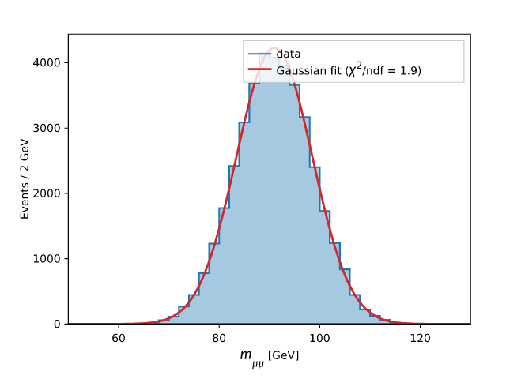
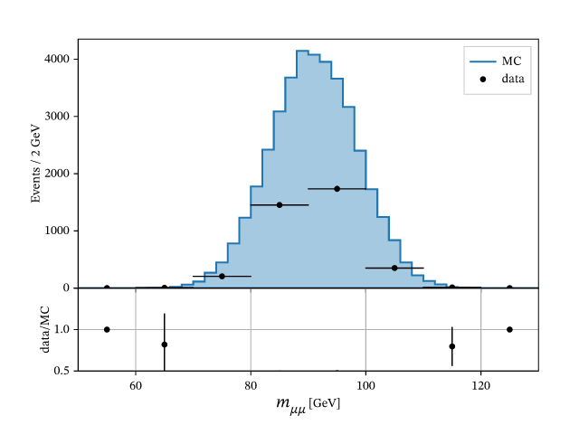

# Plotting

Render histograms and graphs to **SVG, PNG, and PDF** with a matplotlib-like API and an
mplhep histogram style — pure Rust, no matplotlib, no system fonts. Plotting is
behind the **`plot` feature** and exposed as `oxiroot::plot`.

<figure markdown="span">
  { width="49%" }
  { width="49%" }
  <figcaption>Both produced by the bundled <code>plot</code> example (PNG, SVG, and PDF).</figcaption>
</figure>

```toml
[dependencies]
oxiroot = { git = "https://github.com/mathieuouillon/oxiroot", features = ["plot"] }
```

!!! note "How it works"
    One backend-independent draw IR fans out to a [`tiny-skia`](https://crates.io/crates/tiny-skia)
    raster (PNG) and a hand-written SVG, so the two outputs share identical
    geometry. DejaVu Sans (matplotlib's own default font) is bundled and
    text is reduced to glyph outlines, so the SVG is self-contained. `$…$`
    labels are typeset as real LaTeX math by the pure-Rust
    [ReX](https://github.com/KenyC/ReX) TeX engine into the same IR. The `plot`
    feature pulls a pinned git dependency on ReX (it is not on crates.io).

## API conventions

The API mirrors matplotlib but reads as idiomatic Rust:

- **No `set_` prefix** on the chainable setters — `ax.xlabel(…)`, `ax.title(…)`.
- **One options convention** — every artist has a bare method that uses defaults
  (`ax.hist(&h)`) and a `*_with` sibling that takes an options builder
  (`ax.hist_with(&h, HistOpts::new()…)`).
- **Ranges, not pairs** — limits and sampling intervals take a `Range`:
  `ax.xlim(0.0..100.0)`, `ax.function(f, 0.0..10.0)`.
- **No-arg toggles** — `ax.grid()`, `ax.legend()`, `fig.sharex()`, like
  matplotlib's own no-argument forms.

## A first plot

`Axes` mirrors matplotlib's `Axes`. Build it, add artists, label the axes, and
`save` — the format is chosen by the file extension (`.png`, `.svg`, or `.pdf`).

```rust
use oxiroot::plot::Axes;
use oxiroot::prelude::*;

let mut h = TH1::new(50, 0.0, 100.0).named("pt");
h.fill(42.0);

let mut ax = Axes::new();
ax.hist(&h);                       // mplhep step staircase
ax.xlabel("$p_T$ [GeV]");          // LaTeX math via ReX
ax.ylabel("Events");
ax.save("pt.png")?;                // or "pt.svg" / "pt.pdf"
# Ok::<(), oxiroot::plot::Error>(())
```

## Histograms (mplhep style)

`hist` draws a `TH1` as an mplhep staircase. `hist_with` takes a `HistOpts`
builder for control over the type, error bars, color, fill, and legend label.

| `HistType` | Look |
|-----------|------|
| `Step` | Staircase outline closed to the baseline (default) |
| `Fill` | Filled staircase down to the baseline |
| `Errorbar` | Markers at bin centers with error bars (data-point look) |
| `Band` | Shaded `y ± yerr` uncertainty band |

```rust
use oxiroot::plot::{Axes, HistType, HistOpts, Color};

let mut ax = Axes::new();
ax.hist_with(
    &mc,
    HistOpts::new()
        .histtype(HistType::Fill)
        .fill_color(Color::hex("#1f77b4").with_alpha(0.4))
        .label("MC"),
);
ax.hist_with(&data_hist, HistOpts::new().yerr().label("data")); // √N / Sumw2 bars
```

Error bars come from `√N` (or the Sumw2 per-bin error when the histogram tracks
it). `hist`/`hist_with` snap the x-axis to the bin edges and start the y-axis at
zero, the mplhep convention.

## Graphs and profiles

`errorbar` draws a `TGraph` (plain, symmetric, or asymmetric errors) as data
points; `profile` draws a `TProfile` at bin centers. `ErrorbarOpts` controls the
marker, color, caps, and an optional connecting line.

```rust
use oxiroot::plot::{Axes, ErrorbarOpts, Color};

let mut ax = Axes::new();
ax.errorbar_with(&graph, ErrorbarOpts::new().color(Color::BLACK).label("data"));
ax.profile(&prof);
ax.legend();
```

## 2-D histograms

`hist2d`/`hist2d_with` render a `TH2` as a `pcolormesh`-style color grid with a
colorbar, using the real matplotlib `viridis`/`plasma` colormaps.

```rust
use oxiroot::plot::{Axes, Hist2dOpts, Colormap};

let mut ax = Axes::new();
ax.hist2d_with(&th2, Hist2dOpts::new().cmap(Colormap::Viridis).label("entries"));
ax.xlabel("$x$");
ax.ylabel("$y$");
ax.save("heatmap.svg")?;
# Ok::<(), oxiroot::plot::Error>(())
```

`Colormap` covers `Viridis`, `Plasma`, `Gray`, and `GrayR` (matplotlib's
`gray_r`), and parses from a name (`"viridis".parse()`). The value range
autoscale can be overridden with `Hist2dOpts::vrange(vmin..vmax)`.

## Overlaying a fitted curve

`ax.function(f, x0..x1)` samples any closure `f` over the range and draws it as a
smooth line — the way to overlay an analytic curve on a histogram. To overlay a
**fitted model**, fit it with [`oxiroot::fit`](fitting.md) and pass the curve:

```rust
use oxiroot::plot::{Axes, Color, CurveOpts, HistOpts, HistType};
use oxiroot::prelude::*;   // needs `--features plot,fit`
use oxiroot::fit::TF1;

// Fit a Gaussian to the histogram, then overlay the fitted curve.
let model = TF1::gaussian("gaus").estimate_from(&h);
let r = h.fit(&model);
let fitted = model.with_params(r.params.clone());

let mut ax = Axes::new();
ax.hist_with(&h, HistOpts::new().histtype(HistType::Fill).label("data"));
ax.model_with(                                   // the `fit` feature
    &fitted, 50.0..130.0,
    CurveOpts::new().color(Color::hex("#d62728"))
        .label(format!("fit ($\\chi^2$/ndf = {:.1})", r.chi2 / r.ndf.max(1) as f64)),
);
ax.legend();
ax.save("fit.png")?;
# Ok::<(), oxiroot::plot::Error>(())
```

{ width="65%" }

`ax.model`/`ax.model_with` need the **`fit` feature** (they pull `oxiroot-fit`);
the closure-based `ax.function`/`ax.function_with` are always available and work
for the same purpose (`ax.function(|x| fitted.eval(x), 50.0..130.0)`).

## Layouts: grids and ratio plots

A `GridSpec` arranges several panels with custom row/column ratios. Use
`subplots_grid(rows, cols)` for a uniform grid (row-major), or build a custom
`GridSpec` and pass it to `subplots_grid_with`. Fill the returned axes, then hand
them back to the figure.

```rust
use oxiroot::plot::subplots_grid;

let (fig, mut axs) = subplots_grid(2, 2);
axs[0].hist(&h);
axs[1].errorbar(&g);
axs[2].hist2d(&h2);
axs[3].plot(&x, &y);
fig.sharex()                           // common x range, x labels on the bottom row only
    .sharey()                          // common y range, y labels on the left column only
    .suptitle("$Z \\to \\mu\\mu$")     // a figure-level title (LaTeX)
    .with_axes(axs)
    .save("grid.png")?;
# Ok::<(), oxiroot::plot::Error>(())
```

`ratio_subplots()` is the one-call HEP ratio plot: a main panel over a shorter
ratio panel (height ratios 3:1) sharing the x-axis. The panels touch, only the
bottom panel shows x tick labels and the x-axis label, and the common x range is
the union of both panels'.

{ width="65%" }

```rust
use oxiroot::plot::{ratio_subplots, HistOpts, HistType, ErrorbarOpts, Color};

let (fig, mut main, mut ratio) = ratio_subplots();
main.hist_with(&mc, HistOpts::new().histtype(HistType::Fill).label("MC"));
main.ylabel("Events");
main.legend();
ratio.errorbar_with(&data_over_mc, ErrorbarOpts::new().color(Color::BLACK));
ratio.ylim(0.5..1.5);
ratio.ylabel("data/MC");
ratio.xlabel("$m$ [GeV]");
ratio.grid();
fig.ratio(main, ratio).save("ratio.png")?;
# Ok::<(), oxiroot::plot::Error>(())
```

## Grid, output formats, and DPI

`ax.grid()` draws a matplotlib-style light-grey grid at the major ticks (behind
the data); `ax.grid_minor()` adds fainter lines at the minor ticks.

`save`/`save_with` pick the format from the file extension — `.png`, `.svg`, or
`.pdf` (a hand-written vector PDF). `SaveOpts` sets the DPI for a sharper PNG, or
a transparent background:

```rust
use oxiroot::plot::SaveOpts;

ax.save("plot.pdf")?;                                       // vector PDF
ax.save_with("plot.png", SaveOpts::new().dpi(300.0))?;      // 300-DPI raster
ax.save_with("plot.png", SaveOpts::new().transparent())?;
# Ok::<(), oxiroot::plot::Error>(())
```

SVG and PDF are resolution-independent; DPI only affects the PNG raster. To
render without touching the filesystem, `ax.to_svg_string()`,
`ax.to_png_bytes(SaveOpts::new())`, and `ax.to_pdf_bytes()` return the bytes
directly (and the same three methods exist on `Figure`).

## Style

The default look reproduces a plain matplotlib figure: 640×480 px, DejaVu Sans,
the `tab10` color cycle, a black rectangular frame, out-pointing major ticks on
the bottom and left, and 5 % data margins. `Style::mplhep()` switches to
in-pointing ticks on all four sides with minor ticks and a frameless legend.

```rust
use oxiroot::plot::{Axes, Style};

let mut ax = Axes::with_style(Style::mplhep());
```

A `Style` exposes the figure size, dpi, fonts, colors, tick geometry, and margins
if you need to customize further.

## Math labels

Any axis label, title, colorbar label, or legend entry may contain `$…$` math,
typeset by ReX: fractions, radicals, big operators with limits, sub/superscripts,
and Greek all render, e.g. `"$\\frac{1}{\\sigma}\\frac{d\\sigma}{dp_T}$"` or
`"$\\sqrt{s} = 13\\,\\mathrm{TeV}$"`. A malformed math run falls back to plain
text rather than failing.

## Figures and saving

For a single panel, `Axes::save` is the convenient path. For composing or for the
matplotlib-familiar entry point, use `Figure`/`subplots`:

```rust
use oxiroot::plot::subplots;

let (fig, mut ax) = subplots();
ax.hist(&h);
fig.with_axes([ax]).save("pt.png")?;
# Ok::<(), oxiroot::plot::Error>(())
```

## Worked example

```sh
cargo run -p oxiroot --example plot --features plot
```

It renders a Z → μμ overlay, an mplhep step plot with a grid, a 2-D heatmap,
and a ratio plot — each as PNG, SVG, and PDF (and the first at 220 DPI).

## See also

- [Histograms](histograms.md) — the objects being plotted
- [Graphs](graphs.md) — the `TGraph` family
- [Fitting](fitting.md) — fit a model to the same data
- [Reading & writing files](reading-writing.md) — persist the histograms first
```

